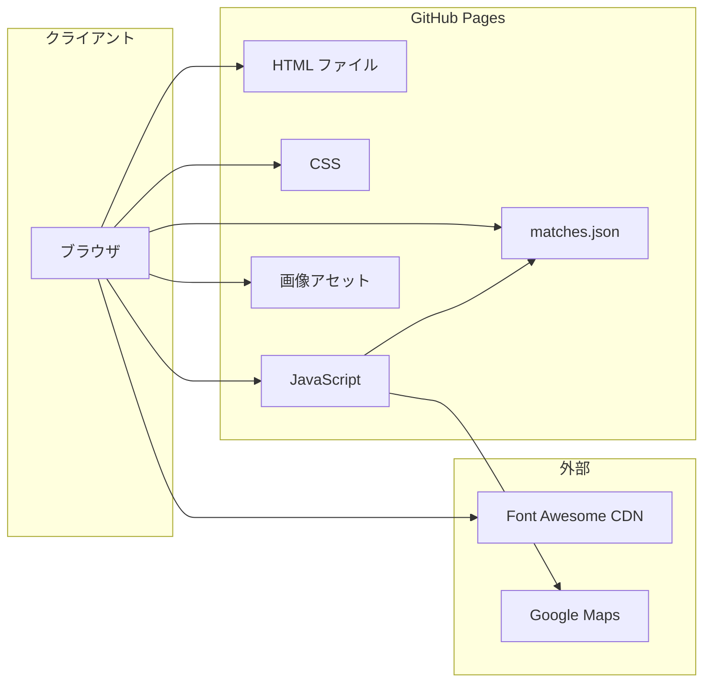

# BLASTERS 公式サイト 要件定義書

東京農工大学アメリカンフットボール部 BLASTERS の公式サイトにおける機能要件・非機能要件を定義する。

---

## 1. プロジェクト概要

### 1.1 目的・背景

- 東京農工大学アメリカンフットボール部 BLASTERS の活動・試合情報・チーム紹介を発信する公式Webサイト
- 関東学生アメリカンフットボール連盟2部所属チームとして、ファン・応援者・新入生候補への情報提供を目的とする

### 1.2 対象ユーザー

| ユーザー種別 | 主なニーズ |
|-------------|------------|
| ファン・応援者 | 試合日程・結果、ニュース、グッズ購入 |
| 新入生候補 | チーム紹介、活動内容、入部案内 |
| 関係者 | イベント情報、チケット情報、問い合わせ |

### 1.3 技術スタック

| カテゴリ | 技術 | 備考 |
|---------|------|------|
| フロントエンド | HTML5, CSS3, JavaScript（バニラ） | フレームワークなし |
| ビルドツール | なし | トランスパイル・バンドルなし |
| アイコン | Font Awesome 4.7.0 | CDN経由 |
| ホスティング | GitHub Pages | kotetu1124.github.io 想定 |

---

## 2. 機能要件

### 2.1 現状の機能一覧（実装済み）

#### トップページ（index.html）

| 機能 | 説明 | 備考 |
|------|------|------|
| ヒーローセクション | ロゴ・キャッチコピー表示 | - |
| BLASTERS紹介 | 部の概要・目標の説明 | - |
| 最新試合結果 | 直近の試合スコア表示 | 静的表示（matches.json 未連携） |
| 次試合情報 | 次の試合の日時・相手・会場 | 静的表示 |
| 監督メッセージ | 監督の挨拶文・写真 | - |

#### ニュース（pages/news.html）

| 機能 | 説明 | 備考 |
|------|------|------|
| 記事一覧 | ニュース記事のリスト表示 | 静的HTML |
| カテゴリ表示 | 記事のカテゴリラベル | - |
| ページネーション | 記事のページ切り替え | 静的 |
| アーカイブ | 過去記事の閲覧 | - |

#### 試合状況（pages/match.html）

| 機能 | 説明 | 備考 |
|------|------|------|
| 試合一覧テーブル | 日付・キックオフ・相手・会場・結果・備考 | data/matches.json から動的生成 |
| シーズンフィルタ | シーズン別に試合を絞り込み | セレクトボックス |
| 会場リンク | 会場名から Google マップ検索リンク生成 | venueUrl 未設定時 |
| 結果表示 | 勝利（緑）・敗北（赤）・試合前（グレー）・中止（オレンジ） | - |

#### チーム（pages/team/player/）

| 機能 | 説明 | 備考 |
|------|------|------|
| 選手・スタッフ一覧 | 学年別・役職別の一覧 | team.html |
| 個人詳細ページ | 出身校・学部・身長・体重等のプロフィール | 約40名分のHTML |
| スムーススクロール | 学年リンクで該当セクションへスクロール | - |

#### ショップ（pages/shop.html）

| 機能 | 説明 | 備考 |
|------|------|------|
| グッズ一覧 | 商品カード形式での表示 | - |
| カテゴリサイドバー | 商品カテゴリでの絞り込み | - |
| 商品詳細リンク | 「詳細を見る」ボタン | 現状 href="#" のプレースホルダー |

### 2.2 未実装機能の要件

| ページ | 概要 | 優先度 |
|--------|------|--------|
| チケット | 試合観戦チケットの購入方法・販売情報 | 高 |
| イベント | 練習試合・合宿・イベント日程 | 高 |
| 新入生の方へ | 入部案内・体験入部・FAQ | 高 |
| 問い合わせ | お問い合わせフォーム・連絡先 | 中 |

※ ナビゲーションにリンクが存在するが、ページ未作成の状態

### 2.3 データソース

| データ | 形式 | 更新方法 | 備考 |
|--------|------|----------|------|
| 試合情報 | data/matches.json | 手動編集 | 試合状況ページで使用 |
| ニュース | 静的HTML | 手動編集 | CMS 導入の検討余地あり |
| ショップ | 静的HTML | 手動編集 | 外部EC連携の検討余地あり |
| 選手情報 | 静的HTML | 手動編集 | - |

---

## 3. 非機能要件

### 3.1 セキュリティ

| 要件 | 現状 | 目標・推奨 |
|------|------|-----------|
| SRI（Subresource Integrity） | Font Awesome に適用済み | 全外部リソースに適用 |
| 外部リンク | `rel="noopener noreferrer"` 適用済み（match.js） | 全 `target="_blank"` に適用 |
| CSP（Content Security Policy） | 未設定 | 導入検討（XSS 対策） |
| フォーム・認証 | なし（問い合わせ未実装） | 実装時は CSRF/XSS 対策必須 |
| 個人情報 | なし | 問い合わせフォーム実装時は取り扱い方針を策定 |

**チェックリスト**

- [ ] 全外部CDN・スクリプトに SRI を付与
- [ ] 問い合わせフォーム実装時：CSRF トークン、入力値検証、サニタイズ
- [ ] 個人情報の収集・保存・利用目的の明示

### 3.2 パフォーマンス

| 要件 | 現状 | 目標・推奨 |
|------|------|-----------|
| 画像最適化 | 未実施（PNG/JPG 等） | WebP 対応、適切な解像度・圧縮 |
| 遅延読み込み | なし | 画像に `loading="lazy"` 適用 |
| キャッシュ制御 | なし | 静的アセットに Cache-Control 設定 |
| 初回表示 | 未計測 | LCP 2.5秒以内を目標（推奨） |

**チェックリスト**

- [ ] 画像の WebP 形式提供・フォールバック
- [ ] ファーストビュー外の画像に `loading="lazy"`
- [ ] GitHub Pages のキャッシュ設定確認（可能な範囲で）

### 3.3 可用性・保守性

| 要件 | 現状 | 目標・推奨 |
|------|------|-----------|
| アクセシビリティ | 一部 aria-label あり | WCAG 2.1 レベル AA 準拠を目指す |
| レスポンシブ | ブレークポイント 1000px / 750px / 670px | 維持・拡張 |
| ブラウザ対応 | 未定義 | 最新2バージョンの Chrome, Edge, Safari, Firefox |

**チェックリスト**

- [ ] 全インタラクティブ要素に適切なアクセシビリティ属性
- [ ] キーボード操作・スクリーンリーダーでの動作確認
- [ ] モバイル・タブレットでの表示確認

### 3.4 運用

| 項目 | 内容 |
|------|------|
| ホスティング | GitHub Pages（静的サイト） |
| 制約 | サーバーサイド処理不可、バックエンドAPI なし |
| データ更新 | matches.json 等をリポジトリで編集し、push で反映 |
| デプロイ | GitHub への push で自動デプロイ |

---

## 4. システム構成

### 4.1 アーキテクチャ



### 4.2 ディレクトリ構成

```
kotetu1124.github.io/
├── index.html              # トップページ
├── css/
│   └── stylesheet.css      # 共通スタイル
├── js/
│   └── match.js            # 試合状況ページ用スクリプト
├── data/
│   └── matches.json        # 試合データ
├── image/                  # 画像アセット
├── pages/
│   ├── news.html
│   ├── match.html
│   ├── shop.html
│   └── team/player/        # チーム・選手ページ
└── docs/
    └── requirements.md     # 本要件定義書
```

### 4.3 外部依存

| 依存先 | 用途 | 備考 |
|--------|------|------|
| BootstrapCDN | Font Awesome 4.7.0 | SRI 対応済み |
| Google Maps | 会場検索リンク | venueUrl 未設定時に動的生成 |

---

## 5. 今後の拡張方針

### 5.1 未実装ページの優先度

1. **高**: 新入生の方へ、チケット、イベント（ナビに表示されているため）
2. **中**: 問い合わせ（フォーム実装が必要）

### 5.2 改善課題

| 課題 | 対応方針 |
|------|----------|
| トップの試合情報が静的 | matches.json と連携し、最新・次試合を動的表示 |
| ナビ・パンくずのパス不統一 | 階層ごとの相対パスを統一し、リンク切れを防止 |
| SNS リンクが `href="#"` | 公式アカウントURL を設定 |
| ショップの「詳細を見る」 | 外部EC・決済連携 or 詳細モーダルを検討 |
| ニュースのデータソース | 静的更新継続 or CMS 導入を検討 |

### 5.3 既知の不具合・軽微な修正

- index.html 40行目: `</section>>` の余分な `>` の修正
- クラス名の揺れ: `instgram` / `instagram`、`X` / `x` の統一
- ニュースページのナビ: `match.html` 等が `#` のまま（リンク切れ）

---

## 改訂履歴

| 版 | 日付 | 内容 |
|----|------|------|
| 1.0 | - | 初版作成 |
