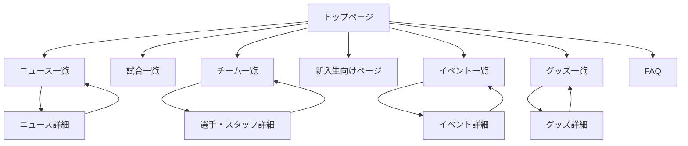
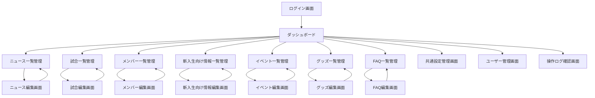

# 東京農工大学アメリカンフットボール部 BLASTERS
# Webアプリ化要件定義書

## 1. 文書概要

### 1.1 目的

本書は、東京農工大学アメリカンフットボール部 BLASTERS の公式HPを、非エンジニアでも管理画面から継続更新できる Web アプリへ移行するための要件を定義するものである。  
現行の静的サイトで公開している情報を維持しつつ、WordPress を CMS として導入し、ニュース、試合情報、チーム情報、新入生向け情報、イベント、グッズ情報などを管理画面で更新可能にする。

### 1.2 背景

- 現行サイトは GitHub Pages 上の静的サイトとして運用されている
- 一部ページは HTML や JSON の直接編集が必要であり、非エンジニアによる更新が難しい
- 更新作業の属人化を防ぎ、マネージャーや担当部員が日常的に情報発信できる体制が必要である
- 将来的な運用継続性を考慮し、管理画面、DB、権限管理、バックアップを備えた CMS 構成が必要である

### 1.3 システム名

東京農工大学アメリカンフットボール部 公式HP管理Webアプリ

### 1.4 想定公開時期

未定

### 1.5 バージョン

1.0

---

## 2. プロジェクト方針

### 2.1 基本方針

- CMS は `WordPress` を採用する
- 非エンジニアでも管理画面から更新できることを最優先とする
- 現行HPの構成・掲載情報を引き継ぎつつ、運用しやすい情報設計へ再編する
- 問い合わせフォーム機能は今回のスコープ外とする
- 保守性と引き継ぎ性を重視し、一般的な WordPress 運用で完結できる構成を基本とする

### 2.2 目的

- 部の活動を継続的かつ迅速に発信できるようにする
- マネージャーや担当部員が、HTML やコードを触らずに更新できるようにする
- 複数担当者による分担運用を可能にする
- 過去データの蓄積、検索、一覧表示をしやすくする
- 公開情報の品質とセキュリティを担保する

### 2.3 成功条件

- 管理者が WordPress 管理画面にログインし、主要コンテンツをブラウザ上で更新できる
- 公開サイトの主要ページが、管理画面で登録したデータに連動して表示される
- 複数権限の運用ができ、誤操作や無断更新を抑制できる
- 画像運用、ログ管理、バックアップ運用が定着できる

---

## 3. 対象ユーザー

### 3.1 公開サイト利用者

| ユーザー種別 | 主な目的 |
|------|------|
| 新入生 | 部の雰囲気、イベント、入部情報の確認 |
| 在学生・保護者 | 試合日程、結果、活動状況の確認 |
| OB・OG | チーム状況、試合情報、ニュースの確認 |
| 一般ファン | チーム紹介、試合結果、グッズ情報の確認 |

### 3.2 管理画面利用者

| 権限 | 想定利用者 | 主な操作 |
|------|------|------|
| 管理者 | 主務、幹部、広報責任者 | 全機能の管理、公開設定、ユーザー管理、権限設定、バックアップ確認 |
| 編集者 | マネージャー、広報担当部員 | コンテンツ作成、更新、画像登録、下書き保存、公開申請 |

### 3.3 権限方針

- 複数権限で運用する
- 管理者のみが、ユーザー管理、権限設定、重要設定変更、削除承認を行える
- 編集者は、担当コンテンツの作成・更新を行える
- 必要に応じて、WordPress 標準権限に加えてカスタム権限の導入を検討する

---

## 4. スコープ

### 4.1 今回の対象範囲

- 公開サイトの再構築
- WordPress の導入
- DB の導入
- ログイン認証機能
- 権限管理機能
- 各種コンテンツの管理機能
- 画像アップロード機能
- 操作ログ管理
- バックアップ運用
- 現行サイトからのデータ移行

### 4.2 管理対象コンテンツ

- トップページ
- ニュース
- 試合情報
- チーム情報
- 選手・スタッフプロフィール
- 新入生向け情報
- イベント情報
- グッズ情報
- FAQ
- 共通設定情報

### 4.3 今回の対象外

- 問い合わせフォーム
- オンライン決済
- 会員機能
- チャット機能
- SNS API 自動連携
- 動画配信機能

---

## 5. システム概要

### 5.1 全体像

本システムは、WordPress を CMS とする公開サイト兼管理サイトである。  
公開側では、訪問者がニュース、試合、チーム、イベント、新入生向け情報、グッズ情報を閲覧できる。  
管理側では、ログインした管理者・編集者が管理画面から各種情報を登録、更新、公開管理する。

### 5.2 想定構成

| 項目 | 内容 |
|------|------|
| CMS | WordPress |
| データベース | MySQL または MariaDB |
| Web サーバー | レンタルサーバーまたは WordPress 運用に適したマネージド環境 |
| 公開環境 | HTTPS 対応必須 |
| 画像保存 | WordPress メディアライブラリ |

### 5.3 運用方針

- 日常更新は管理画面から行う
- テーマやプラグインの更新は管理者が実施する
- コンテンツ更新作業とシステム保守作業を分離する
- 運用マニュアルを整備し、担当交代時に引き継げるようにする

---

## 6. 機能要件

### 6.1 認証・権限管理

| 機能ID | 機能名 | 内容 | 優先度 |
|------|------|------|------|
| A-01 | ログイン認証 | 管理画面ログインを必須とする | 高 |
| A-02 | ユーザー管理 | 管理者が管理画面利用者を追加・編集・停止できる | 高 |
| A-03 | 権限管理 | 管理者、編集者など権限ごとに操作可能範囲を制御する | 高 |
| A-04 | パスワード管理 | パスワード変更、再設定を可能にする | 高 |
| A-05 | アカウント無効化 | 退任者や不要アカウントを無効化できる | 中 |

### 6.2 管理機能共通要件

| 機能ID | 機能名 | 内容 | 優先度 |
|------|------|------|------|
| C-01 | 一覧表示 | 登録済みデータを一覧で確認できる | 高 |
| C-02 | 新規登録 | 各コンテンツを新規作成できる | 高 |
| C-03 | 編集 | 既存コンテンツを更新できる | 高 |
| C-04 | 下書き保存 | 公開前に下書きとして保存できる | 高 |
| C-05 | 公開制御 | 公開、非公開、下書きを切り替えできる | 高 |
| C-06 | 削除 | 不要データを削除または非表示化できる | 中 |
| C-07 | 検索・絞り込み | タイトル、日付、カテゴリ等で検索できる | 中 |
| C-08 | 並び順制御 | 表示順を管理できる | 中 |

### 6.3 トップページ管理

| 機能ID | 機能名 | 内容 | 優先度 |
|------|------|------|------|
| T-01 | 主要表示制御 | トップページの主要掲載情報を管理できる | 高 |
| T-02 | 注目ニュース表示 | 指定したニュースをトップに表示できる | 高 |
| T-03 | 最新試合結果表示 | 最新試合を自動表示または選択表示できる | 高 |
| T-04 | 次試合表示 | 次回試合を自動表示または選択表示できる | 高 |
| T-05 | 固定メッセージ更新 | 部紹介文、監督メッセージ等を更新できる | 中 |

### 6.4 ニュース管理

| 機能ID | 機能名 | 内容 | 優先度 |
|------|------|------|------|
| N-01 | ニュース一覧 | タイトル、公開日、カテゴリ、公開状態を一覧表示する | 高 |
| N-02 | ニュース登録 | タイトル、本文、画像、カテゴリを登録できる | 高 |
| N-03 | ニュース編集 | 投稿済みニュースを更新できる | 高 |
| N-04 | カテゴリ管理 | お知らせ、試合結果、イベント等の分類を管理できる | 中 |
| N-05 | アイキャッチ設定 | 一覧や詳細で表示する画像を設定できる | 中 |
| N-06 | 公開日時設定 | 公開日時を設定できる | 中 |

### 6.5 試合情報管理

| 機能ID | 機能名 | 内容 | 優先度 |
|------|------|------|------|
| G-01 | 試合一覧 | シーズン、日付、対戦相手、結果を一覧表示する | 高 |
| G-02 | 試合登録 | 試合日、開始時刻、対戦相手、会場、リーグ区分を登録できる | 高 |
| G-03 | 結果更新 | スコア、勝敗、備考を更新できる | 高 |
| G-04 | シーズン管理 | 年度・シーズン別に管理できる | 高 |
| G-05 | 会場情報管理 | 会場名、地図リンク、補足情報を登録できる | 中 |
| G-06 | トップ連携 | トップページの最新試合・次試合に連携できる | 高 |

### 6.6 チーム・プロフィール管理

| 機能ID | 機能名 | 内容 | 優先度 |
|------|------|------|------|
| P-01 | メンバー一覧管理 | 選手・スタッフを一覧管理できる | 高 |
| P-02 | プロフィール登録 | 氏名、学年、役職、ポジション、背番号、所属等を登録できる | 高 |
| P-03 | プロフィール編集 | 既存プロフィールを更新できる | 高 |
| P-04 | 写真登録 | 顔写真やプロフィール画像を登録できる | 高 |
| P-05 | 学年別表示 | 学年やスタッフ区分で自動分類表示できる | 高 |
| P-06 | 公開制御 | 卒業、退部、非公開対象を切り替えできる | 中 |

### 6.7 新入生向け情報管理

| 機能ID | 機能名 | 内容 | 優先度 |
|------|------|------|------|
| S-01 | 新入生向け記事管理 | 入部案内、活動紹介、募集情報を更新できる | 高 |
| S-02 | 投稿導線管理 | Instagram など外部リンクを登録できる | 高 |
| S-03 | お知らせ一覧管理 | 新歓情報や募集情報を一覧管理できる | 高 |
| S-04 | 掲載順制御 | 新着順または任意順で表示制御できる | 中 |

### 6.8 イベント情報管理

| 機能ID | 機能名 | 内容 | 優先度 |
|------|------|------|------|
| E-01 | イベント一覧管理 | イベント情報を一覧表示する | 高 |
| E-02 | イベント登録 | 開催日、内容、画像、リンクを登録できる | 高 |
| E-03 | イベント編集 | 内容変更や終了対応ができる | 高 |
| E-04 | 募集状態管理 | 募集中、終了、開催済み等を管理できる | 中 |

### 6.9 グッズ情報管理

| 機能ID | 機能名 | 内容 | 優先度 |
|------|------|------|------|
| H-01 | 商品一覧管理 | 商品名、価格、カテゴリ、表示状態を一覧管理する | 高 |
| H-02 | 商品登録 | 商品説明、価格、画像、カテゴリを登録できる | 高 |
| H-03 | 商品編集 | 販売情報や説明を更新できる | 高 |
| H-04 | カテゴリ管理 | 応援グッズ、タオル、アクセサリー等を管理できる | 中 |
| H-05 | 販売案内更新 | チケット案内や購入方法の文章を更新できる | 中 |

### 6.10 FAQ 管理

| 機能ID | 機能名 | 内容 | 優先度 |
|------|------|------|------|
| F-01 | FAQ 一覧管理 | 質問と回答を一覧管理する | 中 |
| F-02 | FAQ 登録 | 質問、回答、カテゴリを登録できる | 中 |
| F-03 | FAQ 編集 | 内容更新や公開制御を行える | 中 |

### 6.11 共通設定管理

| 機能ID | 機能名 | 内容 | 優先度 |
|------|------|------|------|
| M-01 | 基本情報管理 | チーム名、紹介文、アクセス、SNS リンク等を管理する | 高 |
| M-02 | ナビゲーション管理 | ヘッダー、フッター等の共通導線を管理する | 中 |
| M-03 | バナー管理 | 必要に応じて告知バナーを管理できる | 中 |

---

## 7. データ要件

### 7.1 主な管理データ

| データ区分 | 主な項目 |
|------|------|
| ニュース | タイトル、本文、カテゴリ、公開日、アイキャッチ画像、公開状態 |
| 試合情報 | シーズン、試合日、開始時刻、対戦相手、会場、結果、備考、公開状態 |
| 選手・スタッフ | 氏名、よみ、学年、役職、ポジション、背番号、学部、出身校、身長、体重、プロフィール、写真、公開状態 |
| 新入生向け情報 | タイトル、本文、リンク、掲載日、表示順、公開状態 |
| イベント | タイトル、開催日、本文、募集状況、画像、外部リンク、公開状態 |
| グッズ | 商品名、説明、価格、カテゴリ、画像、表示順、公開状態 |
| FAQ | 質問、回答、カテゴリ、表示順、公開状態 |
| 共通設定 | SNS リンク、アクセス情報、固定文言、バナー情報 |

### 7.2 データベース要件

- WordPress 標準テーブルに加え、必要に応じてカスタム投稿タイプ、カスタムタクソノミー、カスタムフィールドを利用する
- メタ情報の拡張が多いデータは、保守性を考慮して設計する
- 表示項目と管理項目の不整合が起きないよう、画面要件とデータ要件を対応付ける

### 7.3 データ移行要件

- 現行サイトの HTML 掲載内容を棚卸しし、WordPress に移行する
- 既存の選手プロフィール、ニュース、試合情報、グッズ情報、新入生向け情報を移行対象とする
- 画像ファイルの移行時は、ファイル名の整理と重複排除を行う
- 旧URLから新URLへのリダイレクト方針を定める

---

## 8. 画面要件

### 8.1 公開画面

- トップページ
- ニュース一覧・詳細
- 試合一覧
- チーム一覧
- 選手・スタッフ詳細
- 新入生向けページ
- イベント一覧・詳細
- グッズ一覧・詳細
- FAQ

### 8.2 管理画面

- ログイン画面
- ダッシュボード
- ニュース管理画面
- 試合管理画面
- チーム・プロフィール管理画面
- 新入生向け情報管理画面
- イベント管理画面
- グッズ管理画面
- FAQ 管理画面
- 共通設定管理画面
- ユーザー管理画面
- 操作ログ確認画面

### 8.3 ダッシュボード要件

- 最近更新したコンテンツを一覧表示する
- 下書き、公開待ち、公開中件数を確認できる
- 直近の操作履歴を確認できる
- 更新担当者が日常作業に迷わない導線を用意する

### 8.4 画面一覧

#### 公開画面一覧

| 画面ID | 画面名 | 主な内容 | 主な利用者 |
|------|------|------|------|
| SC-01 | トップページ | 部紹介、注目ニュース、最新試合結果、次試合、固定案内 | 全利用者 |
| SC-02 | ニュース一覧 | ニュース一覧、カテゴリ導線、アーカイブ導線 | 全利用者 |
| SC-03 | ニュース詳細 | 個別ニュース本文、関連記事導線 | 全利用者 |
| SC-04 | 試合一覧 | シーズン別試合一覧、結果、会場情報 | 全利用者 |
| SC-05 | チーム一覧 | 学年別、スタッフ別の一覧表示 | 全利用者 |
| SC-06 | 選手・スタッフ詳細 | 個別プロフィール、写真、所属情報 | 全利用者 |
| SC-07 | 新入生向けページ | 入部案内、募集情報、外部SNS導線 | 新入生 |
| SC-08 | イベント一覧 | 新歓、体験会、説明会などの一覧 | 新入生、一般利用者 |
| SC-09 | イベント詳細 | イベント個別内容、開催日、関連リンク | 新入生、一般利用者 |
| SC-10 | グッズ一覧 | 商品一覧、カテゴリ、販売案内 | 一般利用者 |
| SC-11 | グッズ詳細 | 商品説明、価格、画像、購入案内 | 一般利用者 |
| SC-12 | FAQ | よくある質問と回答 | 新入生、一般利用者 |

#### 管理画面一覧

| 画面ID | 画面名 | 主な内容 | 主な利用者 |
|------|------|------|------|
| AD-01 | ログイン画面 | ID・パスワード入力、認証 | 管理者、編集者 |
| AD-02 | ダッシュボード | 更新状況、下書き、最近の操作履歴 | 管理者、編集者 |
| AD-03 | ニュース一覧管理 | ニュース検索、一覧表示、新規作成導線 | 管理者、編集者 |
| AD-04 | ニュース編集画面 | タイトル、本文、カテゴリ、画像、公開設定 | 管理者、編集者 |
| AD-05 | 試合一覧管理 | 試合一覧、シーズン検索、新規作成導線 | 管理者、編集者 |
| AD-06 | 試合編集画面 | 対戦相手、日時、結果、会場、公開設定 | 管理者、編集者 |
| AD-07 | メンバー一覧管理 | 選手・スタッフ一覧、絞り込み、新規登録 | 管理者、編集者 |
| AD-08 | メンバー編集画面 | プロフィール、学年、役職、写真、公開設定 | 管理者、編集者 |
| AD-09 | 新入生向け情報一覧管理 | 募集情報、固定案内、外部リンク管理 | 管理者、編集者 |
| AD-10 | 新入生向け情報編集画面 | 記事本文、導線リンク、掲載順、公開設定 | 管理者、編集者 |
| AD-11 | イベント一覧管理 | イベント検索、一覧、新規作成導線 | 管理者、編集者 |
| AD-12 | イベント編集画面 | 開催日、本文、画像、募集状態、リンク | 管理者、編集者 |
| AD-13 | グッズ一覧管理 | 商品一覧、カテゴリ、表示制御 | 管理者、編集者 |
| AD-14 | グッズ編集画面 | 商品名、価格、説明、画像、公開設定 | 管理者、編集者 |
| AD-15 | FAQ 一覧管理 | FAQ 一覧、カテゴリ、並び順管理 | 管理者、編集者 |
| AD-16 | FAQ 編集画面 | 質問、回答、カテゴリ、公開設定 | 管理者、編集者 |
| AD-17 | 共通設定管理画面 | SNS、アクセス、固定文言、バナー設定 | 管理者 |
| AD-18 | ユーザー管理画面 | アカウント追加、権限変更、無効化 | 管理者 |
| AD-19 | 操作ログ確認画面 | ログイン履歴、更新履歴、公開履歴確認 | 管理者 |

### 8.5 画面遷移図

#### 公開画面遷移図

#### 管理画面遷移図

### 8.6 画面項目一覧

#### AD-04 ニュース編集画面

| 項目名 | 形式 | 必須 | 内容 |
|------|------|------|------|
| タイトル | テキスト | 必須 | ニュース記事の見出し |
| 本文 | リッチテキスト | 必須 | 記事本文 |
| カテゴリ | 選択 | 必須 | お知らせ、試合結果、イベント等 |
| アイキャッチ画像 | 画像 | 任意 | 一覧・詳細で表示する代表画像 |
| 公開日時 | 日時 | 必須 | 公開日、予約公開日時 |
| 公開状態 | 選択 | 必須 | 下書き、公開、非公開 |
| 関連リンク | URL | 任意 | 外部記事や関連ページへのリンク |
| 抜粋 | テキスト | 任意 | 一覧表示用の短文 |
| 表示優先 | 真偽値 | 任意 | トップページでの注目表示制御 |

#### AD-06 試合編集画面

| 項目名 | 形式 | 必須 | 内容 |
|------|------|------|------|
| シーズン | 選択 | 必須 | 年度、シーズン区分 |
| 試合日 | 日付 | 必須 | 試合開催日 |
| 開始時刻 | 時刻 | 任意 | キックオフ時刻 |
| 対戦相手 | テキスト | 必須 | 相手チーム名 |
| 試合区分 | 選択 | 必須 | 公式戦、練習試合、交流戦等 |
| 会場名 | テキスト | 必須 | 試合会場名 |
| 会場URL | URL | 任意 | 地図や会場詳細リンク |
| 自チーム得点 | 数値 | 任意 | 試合後に入力 |
| 相手得点 | 数値 | 任意 | 試合後に入力 |
| 試合結果 | 選択 | 任意 | 勝、敗、分、試合前、中止 |
| 備考 | テキストエリア | 任意 | 補足情報、リーグ名、コメント |
| トップ表示対象 | 真偽値 | 任意 | 最新試合、次試合への連携制御 |
| 公開状態 | 選択 | 必須 | 下書き、公開、非公開 |

#### AD-08 メンバー編集画面

| 項目名 | 形式 | 必須 | 内容 |
|------|------|------|------|
| 氏名 | テキスト | 必須 | 漢字氏名 |
| 氏名よみ | テキスト | 任意 | カナ表記 |
| 区分 | 選択 | 必須 | 選手、スタッフ、コーチ等 |
| 学年 | 選択 | 任意 | 1年、2年、3年、4年、OB等 |
| 役職 | テキスト | 任意 | 主将、MSリーダー等 |
| ポジション | テキスト | 任意 | QB、OL、DL など |
| 背番号 | 数値 | 任意 | ユニフォーム番号 |
| 学部 | テキスト | 任意 | 所属学部 |
| 出身高校 | テキスト | 任意 | 出身校情報 |
| 身長 | 数値 | 任意 | cm 単位を想定 |
| 体重 | 数値 | 任意 | kg 単位を想定 |
| プロフィール本文 | テキストエリア | 任意 | 紹介文、意気込み |
| 顔写真 | 画像 | 任意 | 一覧・詳細で使用する写真 |
| 表示順 | 数値 | 任意 | 学年内の並び制御 |
| 公開状態 | 選択 | 必須 | 公開、非公開、卒業、退部 |

#### AD-10 新入生向け情報編集画面

| 項目名 | 形式 | 必須 | 内容 |
|------|------|------|------|
| タイトル | テキスト | 必須 | 記事または案内の見出し |
| 本文 | リッチテキスト | 必須 | 募集情報、入部案内、説明文 |
| 掲載日 | 日付 | 任意 | 一覧表示用の日付 |
| カテゴリ | 選択 | 任意 | 募集情報、活動紹介、FAQ誘導等 |
| 外部リンクURL | URL | 任意 | Instagram などへの導線 |
| 外部リンク文言 | テキスト | 任意 | ボタンやリンク表示文言 |
| サムネイル画像 | 画像 | 任意 | 一覧カード用画像 |
| 表示順 | 数値 | 任意 | 任意順表示用 |
| 公開状態 | 選択 | 必須 | 下書き、公開、非公開 |

#### AD-12 イベント編集画面

| 項目名 | 形式 | 必須 | 内容 |
|------|------|------|------|
| イベント名 | テキスト | 必須 | イベントタイトル |
| 開催日 | 日付 | 必須 | 開催日 |
| 開催時刻 | 時刻 | 任意 | 開始時刻、集合時刻 |
| 開催場所 | テキスト | 任意 | 会場名、集合場所 |
| 本文 | リッチテキスト | 必須 | イベント詳細 |
| 募集状態 | 選択 | 必須 | 募集中、終了、開催済み |
| 告知画像 | 画像 | 任意 | ポスターやサムネイル |
| 外部リンクURL | URL | 任意 | Instagram 投稿、申込先など |
| 注意事項 | テキストエリア | 任意 | 持ち物、参加条件等 |
| 公開状態 | 選択 | 必須 | 下書き、公開、非公開 |

#### AD-14 グッズ編集画面

| 項目名 | 形式 | 必須 | 内容 |
|------|------|------|------|
| 商品名 | テキスト | 必須 | 商品タイトル |
| 商品説明 | リッチテキスト | 必須 | 商品詳細説明 |
| カテゴリ | 選択 | 必須 | 応援グッズ、タオル、アクセサリー等 |
| 価格 | 数値 | 必須 | 販売価格 |
| 商品画像 | 画像 | 任意 | 一覧・詳細に表示する画像 |
| 在庫状況 | 選択 | 任意 | 販売中、在庫僅少、販売停止等 |
| 購入案内 | テキストエリア | 任意 | 購入方法、受渡方法等 |
| 詳細リンク | URL | 任意 | 外部販売先や関連案内 |
| 表示順 | 数値 | 任意 | 商品一覧の並び順 |
| 公開状態 | 選択 | 必須 | 下書き、公開、非公開 |

#### AD-16 FAQ 編集画面

| 項目名 | 形式 | 必須 | 内容 |
|------|------|------|------|
| 質問 | テキスト | 必須 | FAQ の質問文 |
| 回答 | リッチテキスト | 必須 | 回答本文 |
| カテゴリ | 選択 | 任意 | 新入生向け、観戦案内、グッズ等 |
| 表示順 | 数値 | 任意 | FAQ 一覧での順序 |
| 公開状態 | 選択 | 必須 | 下書き、公開、非公開 |

#### AD-17 共通設定管理画面

| 項目名 | 形式 | 必須 | 内容 |
|------|------|------|------|
| チーム名 | テキスト | 必須 | サイト全体で表示する正式名称 |
| サイト説明文 | テキストエリア | 任意 | トップやメタ情報で使用する説明 |
| 監督メッセージ | リッチテキスト | 任意 | トップページ固定文言 |
| 部紹介文 | リッチテキスト | 任意 | トップページ固定文言 |
| Instagram URL | URL | 任意 | 公式Instagramリンク |
| X URL | URL | 任意 | 公式Xリンク |
| YouTube URL | URL | 任意 | 公式YouTubeリンク |
| 寄付案内URL | URL | 任意 | 支援導線のリンク先 |
| アクセス情報 | テキストエリア | 任意 | キャンパスアクセス情報 |
| ヘッダーナビ設定 | 選択/並び順 | 任意 | 表示ページ、順序制御 |
| フッター文言 | テキストエリア | 任意 | フッター固定文言 |
| バナー画像 | 画像 | 任意 | 告知用バナー |
| バナーリンクURL | URL | 任意 | バナー遷移先 |

#### AD-18 ユーザー管理画面

| 項目名 | 形式 | 必須 | 内容 |
|------|------|------|------|
| 表示名 | テキスト | 必須 | 管理画面表示用の氏名 |
| ログインID | テキスト | 必須 | ログイン用ID |
| メールアドレス | メール | 必須 | 通知、再設定用 |
| 権限 | 選択 | 必須 | 管理者、編集者 |
| 初期パスワード | パスワード | 必須 | 初回配布用パスワード |
| アカウント状態 | 選択 | 必須 | 有効、停止 |
| 備考 | テキストエリア | 任意 | 引き継ぎメモ等 |

#### AD-19 操作ログ確認画面

| 項目名 | 形式 | 必須 | 内容 |
|------|------|------|------|
| 実行日時 | 自動表示 | 必須 | 操作実行日時 |
| 操作者 | 自動表示 | 必須 | 実行ユーザー |
| 対象機能 | 自動表示 | 必須 | ニュース、試合、設定等 |
| 操作種別 | 自動表示 | 必須 | 作成、更新、削除、公開変更、ログイン等 |
| 対象データ | 自動表示 | 任意 | 対象記事名、対象レコード名 |
| 実行結果 | 自動表示 | 必須 | 成功、失敗 |
| 詳細メモ | 自動表示 | 任意 | 差分、エラー内容等 |

### 8.7 画面遷移に関する補足

- 画面遷移図は要件定義段階の主要導線を示すものであり、全リンクを網羅するものではない
- 公開画面は、グローバルナビゲーションと一覧から詳細への遷移を基本とする
- 管理画面は、ログイン後にダッシュボードを起点として各管理一覧、各編集画面へ遷移する
- 詳細な画面項目やボタン配置は、画面設計工程で別途定義する

---

## 9. 非機能要件

### 9.1 運用性

- 非エンジニアが管理画面で更新可能であること
- 一般的な WordPress 操作で更新が完結すること
- 管理項目名や入力項目が分かりやすいこと
- 主要な更新手順をマニュアル化できること

### 9.2 セキュリティ

以下は必須要件とする。

- ログイン認証を必須とする
- 権限管理により、利用者ごとの操作範囲を制御する
- 操作ログを保存し、誰がいつ何を更新したか追跡できること
- 画像アップロード制御を行い、不正なファイル形式や過大サイズを防止すること
- バックアップを定期取得し、障害時に復旧可能であること

追加要件は以下とする。

- 管理画面および公開サイトは HTTPS で提供する
- パスワードは WordPress 標準方式で安全に管理する
- ログイン試行回数制限または不正ログイン対策を行う
- 使用プラグインは必要最小限とし、信頼性の高いものを採用する
- WordPress 本体、テーマ、プラグインの更新運用を定める
- 管理者権限の発行、変更、削除手順を定める
- 個人情報やプロフィール情報の掲載に関して、本人同意を前提とする

### 9.3 性能

- 一般的な閲覧環境で主要ページが 3 秒以内を目標に表示されること
- 画像最適化を行い、表示速度低下を防ぐこと
- 管理画面で大量データを扱う場合でも、検索や一覧表示が著しく遅くならないこと

### 9.4 可用性

- 障害時に復旧できるよう、バックアップと復元手順を定める
- 更新ミス時にロールバックしやすい運用を用意する
- サーバー障害やメンテナンスの影響を最小化する

### 9.5 保守性

- テーマ改修や項目追加がしやすい構成とする
- カスタマイズ内容をドキュメント化する
- 担当者交代時に引き継げる構成とする

### 9.6 対応環境

| 項目 | 要件 |
|------|------|
| 管理画面 | PC 利用を基本とする |
| 公開画面 | PC、スマートフォン、タブレットに対応する |
| 対応ブラウザ | Chrome、Safari、Edge の最新版を対象とする |

---

## 10. セキュリティ運用要件

### 10.1 ログイン認証

- 管理画面は認証済みユーザーのみ利用可能とする
- 共用アカウントではなく、個人ごとのアカウント発行を原則とする

### 10.2 権限管理

- 管理者のみがシステム設定、ユーザー管理、重要削除を行える
- 編集者はコンテンツ更新を行えるが、システム全体設定は変更できない

### 10.3 操作ログ

- 投稿作成、更新、削除、公開状態変更、ログイン履歴を記録する
- 必要期間ログを保持し、問題発生時に追跡可能とする

### 10.4 画像アップロード制御

- 許可拡張子を画像形式に限定する
- 1 ファイルあたりの最大容量を制限する
- 極端に大きい画像はアップロード時に抑制またはリサイズする
- 不適切画像や権利侵害画像を掲載しない運用ルールを定める

### 10.5 バックアップ

- DB バックアップを定期取得する
- アップロード画像を含むファイルバックアップを定期取得する
- 復元手順を文書化する
- バックアップ保存先は本番サーバーと分離する

---

## 11. 技術要件

### 11.1 採用方針

- CMS は WordPress
- DB は MySQL または MariaDB
- テーマは既製テーマ流用ではなく、必要に応じて独自テーマまたは子テーマで実装する
- 運用負荷を抑えるため、プラグイン依存は最小限とする

### 11.2 実装方針

- 現行サイトの情報構造を踏襲しつつ、WordPress テンプレートに置き換える
- ニュース、試合、イベント、グッズ、FAQ、プロフィールは投稿型で管理する
- 共通文言や SNS リンクなどは管理画面から編集可能にする
- SEO 基本設定、OGP、メタ情報設定を可能にする

---

## 12. 移行要件

### 12.1 移行対象

- 既存ページの文章
- 既存のニュース情報
- 試合情報
- 選手・スタッフ情報
- 新入生向け情報
- イベント情報
- グッズ情報
- 画像アセット

### 12.2 移行作業

- 既存情報の一覧化
- WordPress データ構造へのマッピング
- コンテンツ登録
- 表示確認
- リンク切れ確認
- 旧URL整理

### 12.3 移行時の注意点

- 公開中の導線を大きく崩さないこと
- 画像の参照切れを防止すること
- 既存SNSや検索流入に配慮し、必要な URL 維持またはリダイレクトを行うこと

---

## 13. 運用要件

### 13.1 更新体制

- 管理者が運用全体を管理する
- 編集者が日常的な記事・情報更新を行う
- 更新ルール、承認ルール、公開ルールを文書化する

### 13.2 保守体制

- WordPress 本体更新確認
- プラグイン更新確認
- バックアップ取得確認
- 障害時対応手順の明文化

### 13.3 マニュアル整備

- ログイン方法
- ニュース登録方法
- 試合結果更新方法
- 選手情報更新方法
- 画像登録方法
- FAQ 更新方法
- バックアップ確認方法

---

## 14. リスク・留意事項

- WordPress は運用しやすい一方、プラグイン過多になると保守性やセキュリティが低下する
- 非エンジニア運用を優先するため、初期設計で入力項目と権限設計を整理しておく必要がある
- 個人情報や顔写真を扱うため、掲載許諾と公開範囲のルールが必要である
- 将来的に問い合わせ、決済、会員機能を追加する場合は追加のセキュリティ設計が必要である

---

## 15. 今後の検討事項

- 使用サーバーの選定
- 独自ドメイン運用の有無
- 本番・検証環境の分離要否
- 使用プラグインの選定
- デザイン方針の再整理
- 操作ログ、バックアップ、セキュリティ強化の実装方式

---

## 16. 改訂履歴

| 版 | 日付 | 内容 |
|----|------|------|
| 1.0 | 2026-04-16 | 初版作成 |
